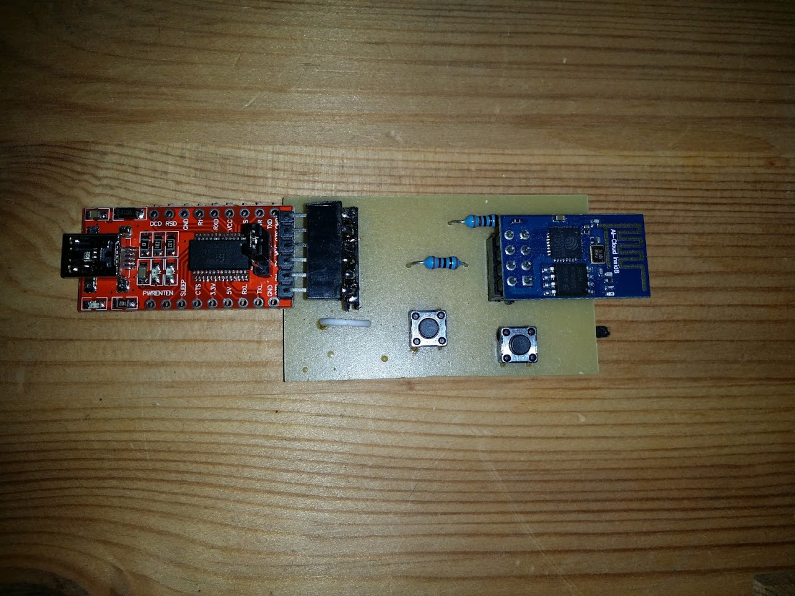

# esp8266-programmer
Please use the Fritzing software (http://fritzing.org/) to open the pcb file (v1.fzz)!

## What you'll need
* FTD1232
* ESP8266
* a piece of wire
* the pcb (v1.fzz)
* 2x 10Ω resistors
* 2x push buttons
* 2X4 pin header
* 1X6 bent pin header

## Short instructions
1. After you produced the pcb, populate it like in the file! There are two lonely holes to the left of S2. Solder a piece of wire between them!
2. Put the FTD1232 into the 1x6 pin header, and the ESP8266 into the 2x4 header! The ESP's antenna has to point away from the FTD1232. 
3. Connect the FTD1232 to your computer!

## And now?
The left button, S2, is the reset button. When you want to enter flash mode, press the right button, S1, before you press the reset button.
